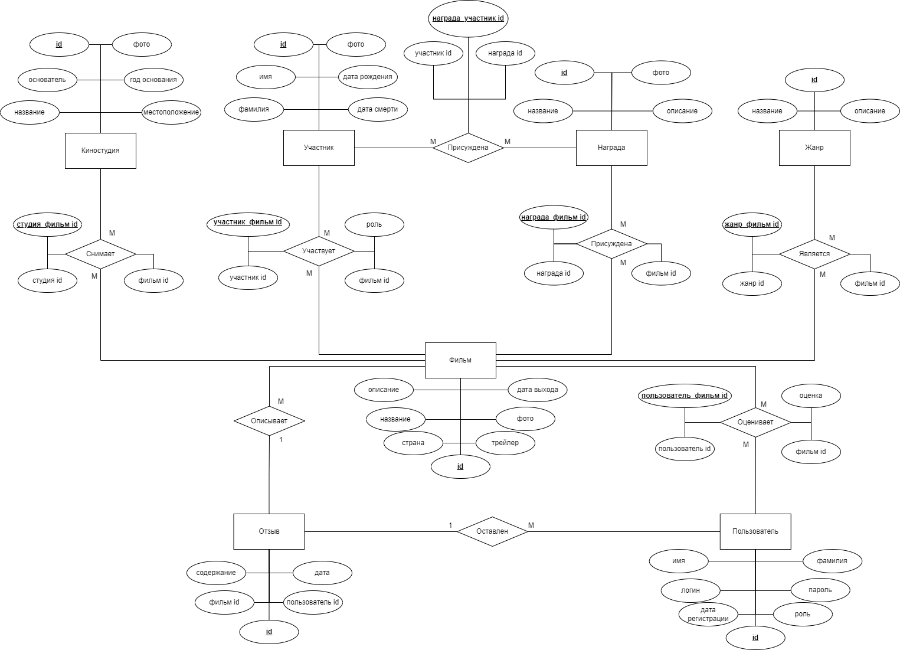

# Название: **Сервис просмотра трейлеров кинопремьер**

## **Краткое описание идеи проекта**

Web-приложение (SPA) с трейлерами кинопремьер, отзывами пользователей и рейтингом ожидания новинок. Для показа трейлеров будет использоваться API Youtube. Управлять содержимым сайта будет администратор.

## **Краткое описание предметной области**

Данное приложение предназначено для просмотра трейлеров.

Предметная область включает в себя следующие сущности:

1. Фильм.
2. Пользователь.
3. Киностудия.
4. Жанр.
5. Отзыв.
6. Творческий работник (актер, режиссер).
7. Награда.

## **Краткое описание акторов (ролей)**

Роли:

1. Пользователь.
2. Гость.
3. Администратор.

## **Use-Case**

### **ER-диаграмма сущностей**

## **Описание типа приложения и технологического стека**

Тип приложения: Web SPA

Технологический стек: Typescript, React.js, PostgreSQL

##  **Верхнеуровневое разбиение на компоненты**

##  **Диаграмма компонентов**

